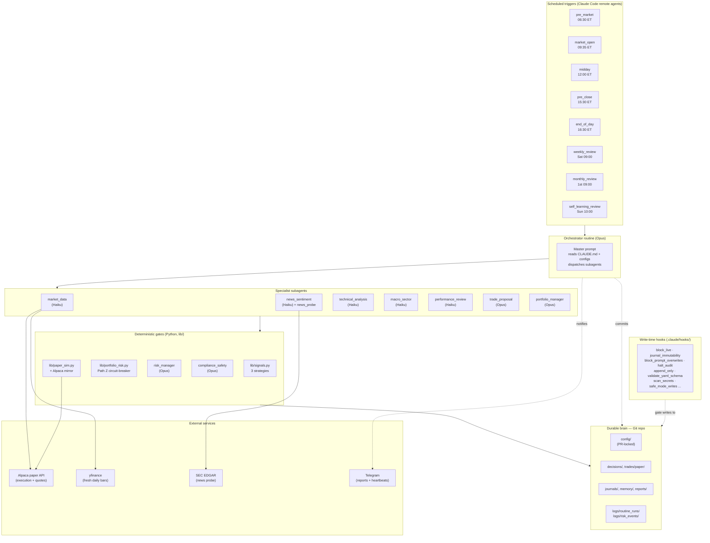

# Calm Turtle

Claude-native, routines-driven multi-strategy paper-trading system for U.S. equities and ETFs.

> Slow, deliberate, defensive. Capital preservation > clever trades.

## What this is

A research-and-paper-trading system that:

- Runs a **3-strategy retail portfolio** (60% trend-following TAA / 30% large-cap momentum / 10% gold overlay) across a **25-symbol universe** of macro ETFs and S&P 100 mega-caps.
- Drives every workflow via **Claude Code scheduled routines** (pre-market, market-open, midday, pre-close, end-of-day, weekly, monthly, self-learning).
- Executes paper trades against the **Alpaca paper sandbox** (real broker-side state) with an internal CSV simulator fallback.
- Enforces a **portfolio-level drawdown circuit-breaker** (Path Z asymmetric: HALF at 8% DD, OUT at 12%, recover OUT→HALF at 8%, HALF→FULL at 5%) on every routine run.
- Persists every decision, journal, trade, audit log, and learning artifact in **Git** for full traceability.
- Pushes summaries + report attachments to **Telegram** as native document cards.

## Goal & current status

| Target | Value | Notes |
|---|---:|---|
| Annualized return | **8–10%** | Absolute target, not relative — SPY reported for context only |
| Max drawdown | **≤ 15%** | 12% halt trigger leaves a 3-pp buffer before the hard cap |
| Sharpe ratio | **≥ 0.8** | Reported once N ≥ 30 closed trades or 90+ trading days |
| Operating mode | **`PAPER_TRADING`** | Set 2026-05-11 via PR-reviewed `config/approved_modes.yaml` |

Backtested 11.15% CAGR / 12.68% DD / 1.14 Sharpe across 2013–2026; realistic forward expectation after survivor-bias and crisis-stress haircuts is **9–10% CAGR with ~15–18% max DD**. See `plan.md` for the full validation trail.

## What this is NOT

- Not financial advice.
- Not a guaranteed-return system. Markets are risky; losses are possible.
- Not authorized to place live orders. v1 is paper-only. Live execution requires explicit human approval + signed risk-profile update + 90+ days of paper evidence.

## Architecture



**The flow:**
1. A scheduled remote agent fires the routine prompt (e.g. `prompts/routines/market_open.md`).
2. The **orchestrator** loads `CLAUDE.md` + configs + recent journals, then dispatches **specialist subagents** in parallel where they're independent.
3. **Deterministic Python** (`lib/signals.py`, `lib/portfolio_risk.py`, `lib/paper_sim.py`) computes signals, circuit-breaker exposure, and fills — Claude wraps but never overrides Python's decisions.
4. **Risk manager** + **compliance/safety** gate every trade decision; either can veto.
5. Approved decisions append to `trades/paper/log.csv` and update `trades/paper/positions.json`; with `BROKER_PAPER=alpaca` they also submit market orders to the Alpaca paper sandbox.
6. Routine commits its artifacts to the branch; auto-merge workflow fast-forwards to `main`.
7. Telegram receives the action summary + report/journal attachments (or a heartbeat on no-op runs).
8. **Write-time hooks** in `.claude/hooks/` enforce every safety rule at the file level — protected configs and routine prompts cannot be modified except through a human-reviewed PR.

## Strategy portfolio

| Strategy | Allocation | Style | Universe |
|---|---:|---|---|
| `dual_momentum_taa` | 60% | Faber 10-month SMA trend filter + relative-momentum selection | SPY / IEF / GLD / SHV (cash floor) |
| `large_cap_momentum_top5` | 30% | Top-5 by 6-month return with SPY 10-mo SMA gate | 20 S&P 100 mega-caps |
| `gold_permanent_overlay` | 10% | Permanent diversifier + crisis hedge | GLD |

All three deterministically coded in `lib/signals.py` and unit-tested in `tests/test_signals.py`. Signals only fire on closing prices via the end-of-day routine; intraday routines monitor open positions and never open new entries.

## Operating modes

Set in `config/approved_modes.yaml` (PR-locked):

| Mode | Behavior |
|---|---|
| `RESEARCH_ONLY` | Produces reports and decisions; no paper or live trades. |
| **`PAPER_TRADING` (current)** | Simulates fills via internal CSV simulator; with `BROKER_PAPER=alpaca` also mirrors to Alpaca paper sandbox. |
| `SAFE_MODE` | Same trading behavior as `PAPER_TRADING` but suppresses every learning-related write — for when the LLM stack is degrading or memory has accumulated noise. Entry via `/enter-safe-mode <reason>`. |
| `LIVE_PROPOSALS` | Emits `PROPOSE_LIVE_*` decisions for human approval. No live orders. (Phase 6+, not yet active.) |
| `LIVE_EXECUTION` | Places live orders within hard limits. (Phase 8+, not yet active.) |
| `HALTED` | Refuses all trading-hour routines; allows read-only inspection. Entry via `/halt-trading <reason>`. |

## Documentation

- [`plan.md`](plan.md) — full architecture, phased roadmap, every backtest and decision log.
- [`todo.md`](todo.md) — implementation checklist with hard gates between phases.
- [`CLAUDE.md`](CLAUDE.md) — operating manual that every routine reads on every run.
- [`docs/risk_profile.md`](docs/risk_profile.md) — signed-off risk profile (the ground-truth doc the system serves).
- [`docs/operator_runbook.md`](docs/operator_runbook.md) — how to run, halt, and recover the system.
- [`docs/incident_response.md`](docs/incident_response.md) — what to do when something is wrong.
- [`docs/model_limitations.md`](docs/model_limitations.md) — what this system cannot do and why.
- [`docs/commit_messages.md`](docs/commit_messages.md) — per-routine commit-message conventions.

## Setup

```bash
python3 -m venv .venv
source .venv/bin/activate
pip install -r requirements.txt   # or: scripts/bootstrap_env.sh
cp .env.example .env.local        # then fill in your Alpaca + Telegram values
python3 tests/run_schema_validation.py
python3 -m pytest tests/ -q       # expect ~318 passing
```

Secrets at runtime come from the Claude Code routine env first, `.env.local` second. See [`docs/operator_runbook.md`](docs/operator_runbook.md) for the full bootstrap, scheduling, and Alpaca-mirror enablement walkthrough.

## Slash commands

User-invocable from any Claude Code session:

| Command | Purpose |
|---|---|
| `/premarket-report` | Manually trigger the pre-market routine. |
| `/weekly-review`, `/monthly-review` | Trigger periodic reviews on demand. |
| `/risk-check` | Print current risk-limit utilization and halt status. |
| `/halt-trading <reason>` | Operator kill switch — flips mode to `HALTED` with paired audit log. |
| `/enter-safe-mode <reason>` | Pause learning writes while keeping the deterministic engine running. |
| `/analyze-symbol <SYM>` | Deep-dive a single watchlist symbol. |
| `/explain-decision <path>` | Re-read a decision file and explain it in plain English. |
| `/propose-paper-trade <SYM>` | Manually request a paper-trade proposal. |
| `/update-daily-journal` | Append a manual note to today's daily journal. |

## License & disclaimers

This is a personal research project, not a service. Not financial advice. The code is provided as-is; you are responsible for any losses incurred from running or adapting it. Live trading is intentionally gated behind multi-phase paper-trading evidence and explicit human approval — do not bypass those gates.
